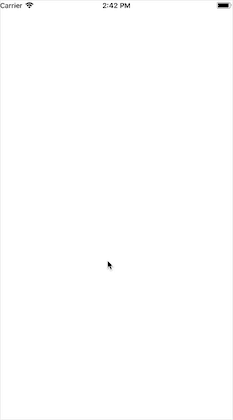

# YAlertView

 弹出框视图
 
演示图：




使用方式：

#### 1.直接调用显示方法

```objc
//1.创建
YAlertView *_alertView = [[YAlertView alloc] initWithBg:@"bg" title:@"公告"];
//2.显示
[_alertView show];


```
#### 2.根据需要配置显示的外观内容
``` objc

//1.创建视图
YAlertView *_alertView = [[YAlertView alloc] initWithBg:@"bg" title:@"公告"];
_alertView.delegate = self;

//2.实现代理方法 配置显示内容
#pragma mark YAlertViewDelegate
- (void)alertView:(YAlertView *)alertView configContentView:(UIScrollView *)scrollView scrollContentView:(UIView *)scrollContentView title:(UILabel *)titleL bgImageV:(UIImageView *)bgImageV {

titleL.textColor = [UIColor whiteColor];
bgImageV.alpha = 0.5;

UILabel *label = [[UILabel alloc] init];
label.text = @"【首部及导言】\
　　\\欢迎您使用腾讯的服务！\
　　　\\　为使用腾讯的服务，您应当阅读并遵守《腾讯服务协议》（以下简称“本协议”）和《QQ号码规则》。请您务必审慎阅读、充分理解各条款内容，特别是免除或者限制责任的条款、管辖与法律适用条款，以及开通或使用某项服务的单独协议。限制、免责条款可能以黑体加粗或加下划线的形式提示您重点注意。除非您已阅读并接受本协议所有条款，否则您无权使用腾讯提供的服务。您使用腾讯的服务即视为您已阅读并同意上述协议的约束。\
　　　　\\　如果您未满18周岁，请在法定监护人的陪同下阅读本协议，并特别注意未成年人使用条款。\
　　　　\
　　　　　\\　一、【协议的范围】\
　　　　　　　1.1本协议是您与腾讯之间关于用户使用腾讯相关服务所订立的协议。“腾讯”是指腾讯公司及其相关服务可能存在的运营关联单位。“用户”是指使用腾讯相关服务的使用人，在本协议中更多地称为“您”。\
　　　　　　　　\\　1.2本协议项下的服务是指腾讯向用户提供的包括但不限于即时通讯、网络媒体、互联网增值、互动娱乐、电子商务和广告等产品及服务（以下简称“本服务”）。\
　　　　　　　　　　1.3本协议内容同时包括《QQ号码规则》（链接地址：\
　　　　　　　　　　http://zc.qq.com/chs/agreement1_chs.html）和《隐私政策》（链接地址：\
　　　　　　　　　　http://www.qq.com/privacy.htm）,且您在使用腾讯某一特定服务时，该服务可能会另有单独的协议、相关业务规则等（以下统称为“单独协议”）。上述内容一经正式发布，即为本协议不可分割的组成部分，您同样应当遵守。您对前述任何业务规则、单独协议的接受，即视为您对本协议全部的接受。\
　　　　　　　　　　\
　　　　　　　　　　　\\　二、【帐号与密码安全】\
　　　　　　　　　　　　　2.1您在使用腾讯的服务时可能需要注册一个帐号。关于您使用帐号的具体规则，请遵守《QQ号码规则》和单独协议。\
　　　　　　　　　　　　　　　2.2腾讯特别提醒您应妥善保管您的帐号和密码。当您使用完毕后，应安全退出。因您保管不善可能导致遭受盗号或密码失窃，责任由您自行承担。";\
　　　　　　　　　　　　　　　label.font = [UIFont systemFontOfSize:12];
　　　　　　　　　　　　　　　label.textColor = [UIColor whiteColor];
　　　　　　　　　　　　　　　label.numberOfLines = 0;
　　　　　　　　　　　　　　　label.frame = CGRectInset(scrollContentView.bounds, 10, 0);
　　　　　　　　　　　　　　　[scrollContentView addSubview:label];
　　　　　　　　　　　　　　　
　　　　　　　　　　　　　　　CGFloat textHeight = [label.text boundingRectWithSize:CGSizeMake(scrollContentView.frame.size.width-20, MAXFLOAT) options:NSStringDrawingUsesLineFragmentOrigin attributes:@{
　　　　　　　　　　　　　　　NSFontAttributeName : [UIFont systemFontOfSize:12]
　　　　　　　　　　　　　　　} context:nil].size.height;
　　　　　　　　　　　　　　　scrollView.contentSize = CGSizeMake(0, textHeight);
　}

```

如果你在使用中遇到了什么问题，或者希望扩展其他功能，可以直接跟我联系。

更多功能敬请期待！ 
